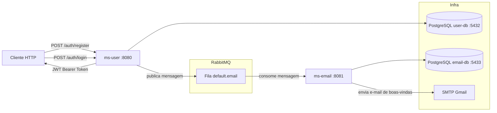

# Estudo de Microsserviços com Java

Projeto de estudo prático de **microsserviços** utilizando **Java**, **Spring Boot**, **RabbitMQ** e **PostgreSQL**, com comunicação **assíncrona** entre serviços e **autenticação JWT**.

O `ms-user` expõe uma API de **registro e login** de usuários. Ao registrar, a senha é criptografada com **BCrypt** e o login devolve um **token JWT** que protege as demais rotas. No registro, uma mensagem também é publicada em uma fila do RabbitMQ: o serviço `ms-email` consome essa mensagem, envia um e-mail de boas-vindas (via SMTP do Gmail) e persiste o registro do envio no banco de dados.

## Arquitetura



### Fluxo

1. O cliente chama `POST /auth/register` no `ms-user` com `name`, `email` e `password`;
2. A senha é codificada com BCrypt e o usuário é salvo no banco `user-db` (409 se o e-mail já existir);
3. Uma mensagem é publicada na fila `default.email` do RabbitMQ;
4. O `ms-email` consome a mensagem da fila;
5. O serviço envia o e-mail de boas-vindas e salva o registro na tabela `TB_EMAILS` com status `SENT` ou `ERROR`;
6. O cliente chama `POST /auth/login` com `email` e `password` e recebe um **token JWT** (válido por 2 horas);
7. Rotas protegidas exigem o header `Authorization: Bearer <token>`; um token ausente/inválido responde `401`.

## Endpoints

### `POST /auth/register` — criar usuário

Registra um novo usuário, dispara o e-mail de boas-vindas e **não exige token**.

```bash
curl -X POST http://localhost:8080/auth/register \
  -H "Content-Type: application/json" \
  -d '{"name":"Maria da Silva","email":"maria@example.com","password":"senha123"}'
```

Resposta esperada (HTTP `201 Created`):

```json
{
  "userId": "29f0f8f4-8c0a-4f8e-8f0a-...",
  "name": "Maria da Silva",
  "email": "maria@example.com"
}
```

> A senha nunca é devolvida na resposta, nem mesmo o hash. E-mail duplicado retorna `409 Conflict`.

### `POST /auth/login` — autenticar e obter token

```bash
curl -X POST http://localhost:8080/auth/login \
  -H "Content-Type: application/json" \
  -d '{"email":"maria@example.com","password":"senha123"}'
```

Resposta esperada (HTTP `200 OK`):

```json
{
  "token": "eyJhbGciOiJIUzI1NiJ9..."
}
```

Credenciais inválidas retornam `401 Unauthorized`.

### Exemplo de rota protegida

```bash
curl http://localhost:8080/algum-recurso \
  -H "Authorization: Bearer <token>"
```

## Serviços

| Serviço | Porta | Responsabilidade |
| --- | --- | --- |
| `ms-user` | 8080 | API REST de cadastro e autenticação (`/auth/register` e `/auth/login`). Gera e valida tokens JWT, salva o usuário e publica mensagem no RabbitMQ |
| `ms-email` | 8081 | Consome a fila, envia e-mails via SMTP e registra o status do envio |

## Stack

- Java 21
- Spring Boot 4.1.1 (WebMVC, Data JPA, AMQP, Mail, Security, Validation)
- JWT (biblioteca `java-jwt` do Auth0)
- RabbitMQ (mensageria / filas)
- PostgreSQL (persistência, um banco por serviço)
- Maven (build)
- Docker & Docker Compose (execução da infraestrutura)

## Estrutura do Projeto

```
microservices/
├── docker-compose.yaml       # Orquestra todos os serviços e dependências
├── .env                      # Credenciais e segredo JWT (não versionado)
├── ms-user/                  # Microsserviço de usuários e autenticação
│   └── src/main/java/com/ms/user/
│       ├── configs/          # CorsConfig, GlobalExceptionHandler, RabbitMQConfig
│       ├── controllers/      # UserController (POST /auth/register, POST /auth/login)
│       ├── dtos/             # UserRecordDto, LoginRequestDto, LoginResponseDto, EmailDto
│       ├── models/           # Entidade User (TB_USERS)
│       ├── producers/        # UserProducer (publica na fila)
│       ├── repositories/     # UserRepository
│       ├── security/         # SecurityConfig, SecurityFilter, TokenService, CustomUserDetailsService
│       └── services/         # UserService (salva e publica)
└── ms-email/                 # Microsserviço de e-mail
    └── src/main/java/com/ms/msemail/
        ├── configs/          # Configuração da fila e do RabbitMQ
        ├── consumers/        # EmailConsumer (@RabbitListener)
        ├── dtos/             # EmailRecordDto
        ├── enums/            # StatusEmail (SENT, ERROR)
        ├── models/           # Entidade Email (TB_EMAILS)
        ├── repositories/     # EmailRepository
        └── services/         # EmailService (envio via JavaMail)
```

## Como executar

### Pré-requisitos

- Docker e Docker Compose
- Java 21 e Maven (para executar os serviços fora do Docker)
- Uma conta Gmail com **senha de app** para envio dos e-mails

### 1. Configurar credenciais

Crie o arquivo `.env` na raiz do projeto (já ignorado pelo git):

```env
MAIL_USERNAME=seu.email@gmail.com
MAIL_PASSWORD=sua-senha-de-app
JWT_SECRET=sua-chave-secreta-jwt
```

> O `ms-email` envia e-mails pelo SMTP do Gmail. Caso o Gmail bloqueie o login,
> gere uma [senha de app](https://support.google.com/accounts/answer/185833) e a utilize no `MAIL_PASSWORD`.
>
> O `JWT_SECRET` é usado para assinar e validar os tokens; use um valor longo e
> aleatório em ambientes reais.

### 2. Subir a infraestrutura

```bash
docker compose up --build
```

Serviços disponíveis:

| Recurso | Endereço |
| --- | --- |
| API `ms-user` | http://localhost:8080 |
| API `ms-email` | http://localhost:8081 |
| RabbitMQ Management | http://localhost:15672 (usuário/senha: `admin` / `12345`) |
| PostgreSQL `user-db` | localhost:5432 |
| PostgreSQL `email-db` | localhost:5433 |

### 3. Testando o fluxo

```bash
# 1. Registrar usuário (dispara o e-mail de boas-vindas)
curl -X POST http://localhost:8080/auth/register \
  -H "Content-Type: application/json" \
  -d '{"name":"Maria da Silva","email":"maria@example.com","password":"senha123"}'

# 2. Fazer login e obter o token
curl -X POST http://localhost:8080/auth/login \
  -H "Content-Type: application/json" \
  -d '{"email":"maria@example.com","password":"senha123"}'

# 3. Usar o token retornado em rotas protegidas
curl http://localhost:8080/algum-recurso \
  -H "Authorization: Bearer SEU_TOKEN"
```

Após o registro, acompanhe no RabbitMQ Management a fila `default.email` e o
recebimento do e-mail de boas-vindas no endereço informado.

## Notas de estudo

- Autenticação stateless com JWT assinado via HMAC-SHA256 e senhas com BCrypt;
- Comunicação assíncrona entre serviços com RabbitMQ (padrão *event-driven*);
- Isolamento de dados: cada microsserviço possui seu próprio banco PostgreSQL;
- Modelo *Transactional Outbox* parcial: o usuário é salvo e a mensagem publicada na mesma transação de serviço;
- Dockerfile em multi-estágio para reduzir o tamanho das imagens;
- Configuração da fila `default.email` definida via `broker.queue.email.name` no `application.properties` de cada serviço.
